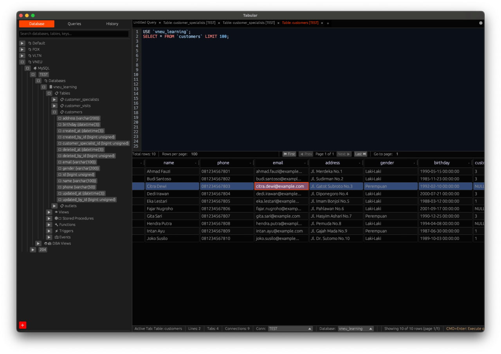

<div align="center">

# Tabular

Your fast, native, cross‑platform SQL & NoSQL database client (Desktop, with early groundwork for iPadOS) — built in Rust.



## 1. About Tabular
Tabular is a lightweight, native database client built with the `eframe`/`egui` stack. It focuses on instant startup, responsive UI, safe concurrency, and a distraction‑free workflow for developers, data engineers, and DBAs. Unlike web/electron apps, Tabular ships as a single native binary with a small memory footprint while still offering rich features like autocomplete, multiple drivers, query history, export tools, and self‑update.

## 2. Key Features
- Unified UI for multiple relational & non‑relational databases
- Drivers: PostgreSQL, MySQL/MariaDB, SQLite, SQL Server (TDS), Redis, MongoDB
- Async runtime (Tokio) for non‑blocking execution
- Multiple query tabs & saved query library (`queries/` folder)
- Query history panel with search & filtering
- Result grid with copy cell / row / full result set
- Export to CSV & XLSX
- Rich value formatting (dates, decimals, JSON, BSON, HEX)
- Connection caching & quick reconnect
- Self‑update (GitHub Releases) with semantic version check
- Configurable data directory (env `TABULAR_DATA_DIR`)
- Native file dialogs (`rfd`)
- Cross‑platform theming via egui
- Sandboxing & notarization ready for macOS

### Query Editor (New, In Progress)
The legacy `egui::TextEdit` editor is being replaced with a custom widget backed by a rope buffer. Current capabilities:
- Multi‑caret editing
- Per‑line syntax highlighting cache (SQL focus first)
- Basic scroll‑to‑caret
- Undo/Redo
- Multi‑line/column selection

Planned next: full autocomplete integration, diff‑based edits, revision tracking, and removal of the legacy path after feature parity.

## 3. Supported Databases
| Category   | Engines / Protocols |
|------------|----------------------|
| Relational | PostgreSQL, MySQL/MariaDB, SQLite, Microsoft SQL Server |
| Document   | MongoDB (BSON & compression) |
| Key/Value  | Redis (async connection manager) |

Notes:
- Microsoft SQL Server uses `tiberius` (TDS over TLS)
- Redis uses pooled async managers
- SQLite runs in‑process (file mode) — ensure write permissions

## 4. Installation

### Option A: Download Prebuilt Release (Recommended)
1. Visit: https://github.com/tabular-id/tabular/releases
2. Download the bundle for your platform:
    - macOS: `.dmg` (notarized) or `.pkg` (if available)
    - Linux: `.tar.gz` (extract, then place the binary in `$HOME/.local/bin` or `/usr/local/bin`)
    - Windows: portable package is planned
3. (macOS) Drag `Tabular.app` into `/Applications`.
4. Run Tabular.

### Option B: Build From Source
General requirements:
- Rust (stable; https://rustup.rs)
- Cargo (bundled with rustup)
- Clang/LLVM (for bindgen / some native crates)
- libclang headers (Linux)
- (Linux) pkg-config, OpenSSL dev packages may be required depending on environment

#### Arch Linux
```bash
sudo pacman -Syu --needed base-devel clang llvm pkgconf
export LIBCLANG_PATH=/usr/lib
git clone https://github.com/tabular-id/tabular.git
cd tabular
cargo build --release
```

#### Ubuntu / Debian
```bash
sudo apt update
sudo apt install -y build-essential clang libclang-dev pkg-config
git clone https://github.com/tabular-id/tabular.git
cd tabular
cargo build --release
```

#### macOS
```bash
xcode-select --install   # Command Line Tools
brew install llvm        # (opsional) clang lebih baru
git clone https://github.com/tabular-id/tabular.git
cd tabular
cargo build --release
```
Jika memakai LLVM dari Homebrew:
```bash
export LIBCLANG_PATH="$(brew --prefix llvm)/lib"
```

#### Windows (MSVC) – planned
Install the MSVC toolchain, then build with `cargo build --release`.

#### Multi‑Arsitektur / Cross Compilation (Desktop + Eksperimental iOS)
```bash
cargo install cross
cross build --target aarch64-apple-darwin --release

# Eksperimental iPadOS (butuh wrapper Xcode/iOS)
rustup target add aarch64-apple-ios
cargo build --target aarch64-apple-ios --release
```

### Run
```bash
./target/release/tabular
```

### Optional Environment Variables
| Variable         | Purpose                             | Example                      |
|------------------|-------------------------------------|------------------------------|
| TABULAR_DATA_DIR | Override data directory location    | /data/tabular                |
| RUST_LOG         | Enable logging                      | RUST_LOG=info ./tabular      |

## 5. macOS Notarized / Signed Builds
For distributing outside the Mac App Store:
```bash
export APPLE_ID="your-apple-id@example.com"
export APPLE_PASSWORD="app-specific-password"
export APPLE_TEAM_ID="TEAMID"
export APPLE_BUNDLE_ID="id.tabular.database"
export APPLE_IDENTITY="Developer ID Application: Your Name (TEAMID)"
export NOTARIZE=1
./build.sh macos --deps
```
Staple & verify:
```bash
xcrun stapler staple dist/macos/Tabular-<version>.dmg
spctl -a -vv dist/macos/Tabular.app
codesign --verify --deep --strict --verbose=2 dist/macos/Tabular.app
```
See `macos/Tabular.entitlements` for sandbox/network/file access settings. For App Store distribution use a distribution identity and provisioning profile:
```bash
export APPLE_IDENTITY="Apple Distribution: Your Name (TEAMID)"
export PROVISIONING_PROFILE="/path/Tabular_AppStore.provisionprofile"
make pkg-macos-store
```

## 6. Data Directory (Configurable)
Default location:
- macOS / Linux: `~/.tabular`

Change it via Preferences (native folder picker) or force it with:
```bash
export TABULAR_DATA_DIR="/absolute/custom/path"
./tabular
```
Manual migration: copy the old folder to the new location before switching & restarting.

Contents of the data directory:
- `preferences.*` — UI & app settings
- `cache.*` — metadata & driver caches
- `queries/` — saved queries
- `history/` — executed query history

## 7. Development Guide
### Project Layout (selected)
```
src/
    main.rs              # Entry point
    window_egui.rs       # UI / egui integration
    editor.rs            # Logika editor query
    editor_autocomplete.rs
    sidebar_*.rs         # Panel samping (database, history, queries)
    driver_*.rs          # Abstraksi driver database
    export.rs            # Ekspor CSV / XLSX
    self_update.rs       # Cek & aplikasi update
    config.rs            # Preferensi & direktori data
    models/              # Struktur data & enum
    query_ast/           # Lapisan AST kueri (eksperimental, default aktif)
```

### Quick Start (Dev)
```bash
git clone https://github.com/tabular-id/tabular.git
cd tabular
cargo run
```

### Common Tasks
| Action        | Command                          |
|---------------|----------------------------------|
| Build debug   | `cargo build`                    |
| Run           | `cargo run`                      |
| Test          | `cargo test`                     |
| Lint (clippy) | `cargo clippy -- -D warnings`    |
| Format        | `cargo fmt`                      |
| Release build | `cargo build --release`          |

### Logging
```bash
RUST_LOG=info cargo run
```

### Adding a New Driver (short)
1) Create `driver_<engine>.rs`  2) Implement connection & execution  3) Add feature flag if optional  4) Register in `modules.rs`/factory  5) Update README.

## 8. Core Dependencies (Crates)
| Purpose        | Crate |
|----------------|-------|
| UI & App Shell | eframe, egui_extras |
| Async Runtime  | tokio, futures, futures-util, tokio-util |
| Relational DB  | sqlx (postgres, mysql, sqlite) |
| SQL Server     | tiberius |
| Redis          | redis |
| MongoDB        | mongodb, bson |
| Data Formats   | serde, serde_json, chrono, rust_decimal, hex, csv, xlsxwriter |
| File Dialog    | rfd |
| Update         | reqwest, self_update, semver |
| Logging        | log, env_logger, dotenv |
| Utilities      | dirs, regex, colorful |

See `Cargo.toml` for exact versions (current package version: 0.5.18).

## 9. Contributing
Contributions are welcome (bug fixes, new drivers, UI, performance). Suggested workflow:
1. Fork & create a feature branch.
2. Run `cargo fmt && cargo clippy` before committing.
3. Ensure release build compiles: `cargo build --release`.
4. Open a PR with a concise description & screenshots (for UI changes).

## 10. Troubleshooting
| Issue                           | Hint                                               |
|---------------------------------|----------------------------------------------------|
| Build fails: clang not found    | Install clang / set `LIBCLANG_PATH`                |
| TLS errors on connect           | Verify certificates & network reachability         |
| SQLite file locked              | Close other processes; check file permissions      |
| UI freeze on long queries       | Use server pagination; streaming improvements WIP  |

## 11. Roadmap (High level)
- Windows build & signing
- iPadOS adaptive layout
- Query formatter / beautifier
- Result pagination for large datasets
- Connection grouping & tags
- Scripting/extension layer
- Secure secrets storage (Keychain/KWallet/Credential Manager)

## 12. License
This project is dual‑licensed:

1) GNU Affero General Public License v3 (AGPL‑3.0) — see `LICENSE-AGPL`
2) Commercial License — contact PT. Vneu Teknologi Indonesia (see `LICENSE`)

In short: use AGPL for OSS/non‑commercial; obtain a commercial license for closed‑source/commercial integration.

## 13. Acknowledgements
Built with the Rust ecosystem. egui & sqlx projects are especially instrumental.

---
Made with Rust 🦀 for people who love fast, native tools.

## 14. Agnostic AST Architecture (Advanced)

## 📋 Overview

Tabular uses a **database‑agnostic AST (Abstract Syntax Tree)** to separate query logic from database‑specific implementations. Benefits:

- ✅ **Performa Optimal**: Plan caching, rewrite optimization
- ✅ **Kemudahan Extensibility**: Tambah database baru tanpa ubah core logic
- ✅ **Type Safety**: Compile-time checking dengan Rust
- ✅ **Maintainability**: Clear separation of concerns

## 🏗️ Architecture Layers

### Layer 1: Parser (Database‑agnostic)
```
Raw SQL → sqlparser → AST (generic) → Logical Plan
```
- Uses the `sqlparser` crate for universal SQL parsing
- Not aware of any specific database
- Output: `LogicalQueryPlan` (database‑agnostic IR)

**File**: `src/query_ast/parser.rs`

### Layer 2: Logical Plan (Agnostik DB)
```rust
pub enum LogicalQueryPlan {
    Projection { exprs: Vec<Expr>, input: Box<LogicalQueryPlan> },
    Filter { predicate: Expr, input: Box<LogicalQueryPlan> },
    Sort { items: Vec<SortItem>, input: Box<LogicalQueryPlan> },
    Limit { limit: u64, offset: u64, input: Box<LogicalQueryPlan> },
    Join { left, right, on, kind },
    TableScan { table, alias },
    // ... etc
}
```

**File**: `src/query_ast/logical.rs`

**Benefits**:
- All databases share the same structure
- Optimizations apply to all databases
- Easy to visualize and debug

### Layer 3: Rewrite/Optimizer (Database‑agnostic)
```
Logical Plan → Apply Rules → Optimized Logical Plan
```

**Rules** (apply to all databases):
- Filter pushdown
- Projection pruning
- CTE inlining
- Predicate merging
- Auto‑limit injection
- Pagination rewrite

**File**: `src/query_ast/rewrite.rs`

**Example**:
```rust
// Before rewrite:
Projection -> Filter -> Filter -> TableScan
// After rewrite:
Projection -> Filter(merged) -> TableScan
```

### Layer 4: Emitter (Database‑specific)
```
Optimized Plan → Dialect → SQL for Target DB
```

**Trait-based**:
```rust
pub trait SqlDialect {
    fn quote_ident(&self, ident: &str) -> String;
    fn emit_limit(&self, limit: u64, offset: u64) -> String;
    fn supports_window_functions(&self) -> bool;
    // ... etc
}
```

**Implementations**:
- `MySqlDialect`: Backticks, `LIMIT n OFFSET m`
- `PostgresDialect`: Double quotes, window functions
- `MssqlDialect`: Square brackets, `TOP n`, `OFFSET FETCH`
- `SqliteDialect`: Backticks, limited window support
- `MongoDialect`: Minimal SQL, mostly native operations
- `RedisDialect`: Very limited SQL

**Files**:
- `src/query_ast/emitter/mod.rs` (core emitter)
- `src/query_ast/emitter/dialect.rs` (dialect trait + implementations)

### Layer 5: Executor (Database‑specific)
```
Emitted SQL → Connection Pool → Execute → Results
```

**Trait-based**:
```rust
#[async_trait]
pub trait DatabaseExecutor {
    fn database_type(&self) -> DatabaseType;
    async fn execute_query(&self, sql: &str, ...) -> Result<QueryResult, ...>;
    fn supports_feature(&self, feature: SqlFeature) -> bool;
}
```

**File**: `src/query_ast/executor.rs`

## 📊 Performance Optimizations

### 1. Multi-Level Caching

```rust
// Level 1: Structural fingerprint (quick pre-check)
let fp = structural_fingerprint(sql); // hash without parsing

// Level 2: Logical plan hash (after parsing)
let plan = parse(sql);
let plan_hash = hash_plan(&plan);

// Cache key includes: plan_hash + db_type + pagination + options
let cache_key = format!("{}::{:?}::{:?}", plan_hash, db_type, pagination);
```

**Cache Stats Available**:
```rust
let (hits, misses) = query_ast::cache_stats();
println!("Cache hit rate: {:.1}%", hits as f64 / (hits + misses) as f64 * 100.0);
```

### 2. Plan Reuse

Same logical plan works for different databases:
```
Parse once → Rewrite once → Emit N times (one per DB type)
```

### 3. Zero-Copy Where Possible

- Use `Arc<LogicalQueryPlan>` untuk sharing plans
- String interning untuk column/table names
- COW (Copy-on-Write) untuk rewrites

## 🔧 Implementation Status

### ✅ Completed

| Feature | Status | Notes |
|---------|--------|-------|
| Basic SELECT parsing | ✅ | Includes JOIN, GROUP BY, HAVING, LIMIT |
| Filter/WHERE | ✅ | AND/OR/NOT, comparison ops |
| Projection/SELECT list | ✅ | Columns, aliases, * |
| Sorting/ORDER BY | ✅ | Multiple columns, ASC/DESC |
| Pagination/LIMIT | ✅ | Rewritten per database |
| JOINs | ✅ | INNER, LEFT, RIGHT, FULL |
| GROUP BY | ✅ | Multiple expressions |
| HAVING | ✅ | Post-aggregation filters |
| DISTINCT | ✅ | Deduplication |
| CTEs/WITH | ✅ | Single-use CTE inlining |
| UNION/UNION ALL | ✅ | Set operations |
| Window Functions | ✅ | ROW_NUMBER, RANK, etc |
| Subqueries | ✅ | Scalar, correlated detection |
| Plan Caching | ✅ | Multi-level with fingerprinting |
| Rewrite Rules | ✅ | 9 rules implemented |
| MySQL Dialect | ✅ | Full support |
| PostgreSQL Dialect | ✅ | Full support |
| SQLite Dialect | ✅ | Full support |
| MS SQL Dialect | ✅ | TOP/OFFSET FETCH syntax |
| MongoDB Dialect | 🟡 | Limited SQL, prefer native |
| Redis Dialect | 🟡 | Very limited |

### 🚧 In Progress / TODO

| Feature | Priority | Effort |
|---------|----------|--------|
| Executor trait implementation | HIGH | Medium |
| Database-specific executors | HIGH | Medium |
| Multi-statement support | MEDIUM | High |
| DDL parsing (CREATE/ALTER/DROP) | MEDIUM | High |
| Advanced subquery optimizations | LOW | High |
| Correlated subquery rewrite | LOW | High |
| Cost-based optimization | LOW | Very High |

## 📈 Benchmarks (indicative)

### Query Compilation Time

```
Simple SELECT:     < 1ms   (cache hit: < 0.1ms)
With JOIN:         < 5ms   (cache hit: < 0.1ms)
Complex (3+ JOINs): < 20ms (cache hit: < 0.1ms)
```

### Cache Hit Rates

```
Repeated queries:  95%+ hit rate
Pagination queries: 90%+ hit rate
Ad-hoc queries:    40%+ hit rate (fingerprint matching)
```

### Memory Usage

```
Per cached plan:   ~5KB (typical)
Cache size limit:  1000 plans (configurable)
Total overhead:    ~5MB for 1000 plans
```

## 🎯 Best Practices

### Untuk Penulis Driver

1. **Use the AST pipeline** instead of raw SQL where possible
2. **Implement SqlDialect** for your database
3. **Implement DatabaseExecutor** for execution
4. **Test with real queries** from your database
5. **Measure performance** before/after AST integration

### Untuk Penulis Query

1. **Use standard SQL** for best cross-database compatibility
2. **Avoid database-specific features** in shared code
3. **Let the AST handle optimization** (don't manually optimize)
4. **Check cache stats** to verify query reuse

### Untuk Maintainer

1. **Keep layers separate** (don't mix concerns)
2. **Add tests for new rewrites** (prevent regressions)
3. **Document dialect differences** in code comments
4. **Profile regularly** to catch performance regressions

## 🐛 Debugging Tools

### 1. Debug Plan Visualization

```rust
let debug_str = query_ast::debug_plan(&sql, &db_type)?;
println!("{}", debug_str);
// Output:
// -- debug plan for PostgreSQL
// Projection 3
//   Filter "id > 10"
//     TableScan(users alias=None)
```

### 2. Rewrite Rule Tracking

```rust
let rules = query_ast::last_rewrite_rules();
println!("Applied rules: {:?}", rules);
// Output: ["auto_limit", "filter_pushdown", "projection_prune"]
```

### 3. Plan Metrics

```rust
let (nodes, depth, subqueries, correlated, windows) = query_ast::plan_metrics(&sql)?;
println!("Plan complexity: {} nodes, depth {}", nodes, depth);
```

### 4. Structural Fingerprint

```rust
let (hash, cache_key) = query_ast::plan_structural_hash(&sql, &db_type, pagination, auto_limit)?;
println!("Plan hash: {:x}", hash);
```

## 📚 Referensi

### Key Files

```
src/query_ast/
├── mod.rs              # Public API & main compilation pipeline
├── ast.rs              # Raw AST wrapper (thin layer over sqlparser)
├── logical.rs          # Logical plan IR (database-agnostic)
├── parser.rs           # SQL → Logical plan conversion
├── emitter/
│   ├── mod.rs          # Plan → SQL emission
│   └── dialect.rs      # Database-specific SQL generation
├── rewrite.rs          # Optimization rules
├── executor.rs         # Execution trait & registry
├── plan_cache.rs       # Multi-level caching
└── errors.rs           # Error types

src/driver_*.rs         # Database-specific drivers (legacy + AST integration)
src/connection.rs       # Connection pool management
src/cache_data.rs       # Metadata caching (tables, columns, etc)
```

### External Dependencies

- **sqlparser**: SQL parsing (universal)
- **tokio**: Async runtime
- **sqlx**: Database drivers (MySQL, PostgreSQL, SQLite)
- **tiberius**: MS SQL driver
- **mongodb**: MongoDB native driver
- **redis**: Redis client

## 🔮 Future Enhancements

### Phase 2: Advanced Features

1. **Cost-Based Optimizer**: Choose optimal join order
2. **Materialized Views**: Cache intermediate results
3. **Parallel Execution**: Split queries across cores
4. **Query Federation**: JOIN across different databases

### Phase 3: Code Generation

1. **Compile to native code**: LLVM backend for hot queries
2. **SIMD optimizations**: Vectorize filters and aggregations
3. **GPU acceleration**: Offload heavy computations

### Phase 4: AI Integration

1. **Query suggestions**: Based on schema and data
2. **Auto-indexing**: Recommend indexes based on query patterns
3. **Query rewrite hints**: AI-powered optimization suggestions

## 🤝 Contributing

See `Adding a New Database to Tabular` for step-by-step guide to adding new database support.

### Code Review Checklist

- [ ] Logical plan changes don't break existing databases
- [ ] New rewrites have tests for correctness
- [ ] Dialect changes respect database feature sets
- [ ] Performance benchmarks show no regressions
- [ ] Documentation updated for new features

## 📞 Support

- **Issues**: GitHub issues for bugs
- **Discussions**: GitHub discussions for questions
- **Docs**: This file + inline code documentation
- **Examples**: See `tests/query_ast_tests.rs`

---

**Last Updated**: 2025-11-11
**Version**: 0.5.18
**Maintainer**: Tabular Team


# Adding a New Database to Tabular

This guide explains how to add support for a new database type using the Agnostic AST architecture.

## Overview

Tabular uses a layered architecture with clear separation of concerns:

```
Raw SQL → Parser → Logical Plan → Optimizer/Rewriter → Emitter → Executor
                       ↓              ↓                    ↓         ↓
                   DB-Agnostic   DB-Agnostic          DB-Specific  DB-Specific
```

## Steps to Add a New Database

### 1. Define Database Type

Add your database to `src/models/enums.rs`:

```rust
#[derive(Clone, PartialEq, Serialize, Deserialize, Debug)]
pub enum DatabaseType {
    MySQL,
    PostgreSQL,
    SQLite,
    Redis,
    MsSQL,
    MongoDB,
    YourNewDB, // <- Add here
}

pub enum DatabasePool {
    MySQL(Arc<MySqlPool>),
    PostgreSQL(Arc<PgPool>),
    SQLite(Arc<SqlitePool>),
    Redis(Arc<ConnectionManager>),
    MsSQL(Arc<MssqlConfigWrapper>),
    MongoDB(Arc<MongoClient>),
    YourNewDB(Arc<YourDbConnection>), // <- Add here
}
```

### 2. Implement SQL Dialect

Create `src/query_ast/emitter/your_db_dialect.rs`:

```rust
use super::dialect::SqlDialect;
use crate::models::enums::DatabaseType;

pub struct YourDbDialect;

impl SqlDialect for YourDbDialect {
    fn db_type(&self) -> DatabaseType {
        DatabaseType::YourNewDB
    }
    
    fn quote_ident(&self, ident: &str) -> String {
        // Your database's identifier quoting
        format!("\"{}\"", ident.replace('"', "\"\""))
    }
    
    fn emit_limit(&self, limit: u64, offset: u64) -> String {
        // Your database's LIMIT syntax
        if offset > 0 {
            format!(" LIMIT {} OFFSET {}", limit, offset)
        } else {
            format!(" LIMIT {}", limit)
        }
    }
    
    fn supports_window_functions(&self) -> bool {
        true // or false, depending on your DB
    }
    
    fn supports_cte(&self) -> bool {
        true // or false
    }
    
    fn supports_full_join(&self) -> bool {
        true // or false
    }
    
    // Override other methods as needed for your database
}
```

Update `src/query_ast/emitter/dialect.rs`:

```rust
pub fn get_dialect(db_type: &DatabaseType) -> Box<dyn SqlDialect> {
    match db_type {
        DatabaseType::MySQL => Box::new(MySqlDialect),
        DatabaseType::PostgreSQL => Box::new(PostgresDialect),
        // ... other databases ...
        DatabaseType::YourNewDB => Box::new(YourDbDialect), // <- Add here
    }
}
```

### 3. Implement Database Executor

Create `src/query_ast/executors/your_db_executor.rs`:

```rust
use async_trait::async_trait;
use crate::query_ast::executor::{DatabaseExecutor, QueryResult};
use crate::query_ast::errors::QueryAstError;
use crate::models::enums::DatabaseType;

pub struct YourDbExecutor {
    // Connection pool or client reference
}

impl YourDbExecutor {
    pub fn new() -> Self {
        Self {}
    }
}

#[async_trait]
impl DatabaseExecutor for YourDbExecutor {
    fn database_type(&self) -> DatabaseType {
        DatabaseType::YourNewDB
    }
    
    async fn execute_query(
        &self,
        sql: &str,
        database_name: Option<&str>,
        connection_id: i64,
    ) -> Result<QueryResult, QueryAstError> {
        // 1. Get connection from pool using connection_id
        // 2. Switch database if database_name is provided
        // 3. Execute SQL query
        // 4. Convert results to (Vec<String>, Vec<Vec<String>>)
        // 5. Return results
        
        todo!("Implement query execution for your database")
    }
    
    fn validate_query(&self, sql: &str) -> Result<(), QueryAstError> {
        // Optional: Add database-specific validation
        Ok(())
    }
}
```

Register in `src/query_ast/executor.rs`:

```rust
impl ExecutorRegistry {
    pub fn with_defaults() -> Self {
        let mut registry = Self::new();
        
        // ... existing executors ...
        
        #[cfg(feature = "your_db")]
        registry.register(Box::new(super::executors::YourDbExecutor::new()));
        
        registry
    }
}
```

### 4. Create Driver Module

Create `src/driver_your_db.rs`:

```rust
use crate::models::enums::DatabaseType;
use crate::window_egui::Tabular;

/// Create connection pool for your database
pub async fn create_connection_pool(
    host: &str,
    port: u16,
    username: &str,
    password: &str,
    database: Option<&str>,
) -> Result<YourDbConnection, Box<dyn std::error::Error>> {
    // Implement connection creation
    todo!()
}

/// Fetch tables from your database
pub async fn fetch_tables_from_connection(
    tabular: &Tabular,
    connection_id: i64,
    database_name: Option<String>,
) -> Result<Vec<String>, Box<dyn std::error::Error>> {
    // Implement table listing
    todo!()
}

/// Fetch columns from a table
pub async fn fetch_columns_from_table(
    tabular: &Tabular,
    connection_id: i64,
    database_name: Option<String>,
    table_name: &str,
) -> Result<Vec<(String, String)>, Box<dyn std::error::Error>> {
    // Implement column listing (name, type)
    todo!()
}
```

### 5. Update Connection Module

In `src/connection.rs`, add your database to the connection creation logic:

```rust
pub async fn get_or_create_connection_pool(
    tabular: &mut Tabular,
    connection_id: i64,
) -> Result<models::enums::DatabasePool, Box<dyn std::error::Error>> {
    // ... existing code ...
    
    match connection.connection_type {
        models::enums::DatabaseType::MySQL => { /* ... */ }
        models::enums::DatabaseType::PostgreSQL => { /* ... */ }
        // ... other databases ...
        models::enums::DatabaseType::YourNewDB => {
            let client = driver_your_db::create_connection_pool(
                &connection.host,
                connection.port,
                &connection.username,
                &connection.password,
                connection.database.as_deref(),
            ).await?;
            
            let pool = models::enums::DatabasePool::YourNewDB(Arc::new(client));
            tabular.connection_pools.insert(connection_id, pool.clone());
            Ok(pool)
        }
    }
}
```

### 6. Add UI Support

In `src/sidebar_database.rs`, add folder icon and logic:

```rust
pub fn create_database_folders_from_connections(connections: &[models::structs::Connection]) -> Vec<models::structs::TreeNode> {
    // ... existing code ...
    
    models::enums::DatabaseType::YourNewDB => {
        let mut node = models::structs::TreeNode {
            name: format!("Your DB Connections ({})", count),
            node_type: models::enums::NodeType::YourNewDBFolder,
            // ... rest of initialization ...
        };
        node
    }
}
```

Add to `src/models/enums.rs`:

```rust
pub enum NodeType {
    // ... existing types ...
    YourNewDBFolder, // <- Add here
}
```

## Testing Your Integration

### Unit Tests

```rust
#[cfg(test)]
mod tests {
    use super::*;
    
    #[tokio::test]
    async fn test_your_db_query() {
        let executor = YourDbExecutor::new();
        let result = executor.execute_query(
            "SELECT * FROM users LIMIT 10",
            None,
            1,
        ).await;
        
        assert!(result.is_ok());
    }
    
    #[test]
    fn test_your_db_dialect() {
        let dialect = YourDbDialect;
        assert_eq!(dialect.quote_ident("table"), "\"table\"");
    }
}
```

### Integration Testing

1. Create a test connection in the UI
2. Test basic operations: connect, list tables, query data
3. Test AST features: filtering, sorting, pagination
4. Test error handling: invalid queries, connection failures

## Performance Considerations

### Connection Pooling

- Use connection pools for better performance
- Configure appropriate pool size (5-20 connections typically)
- Implement connection health checks

### Query Optimization

- The rewrite layer applies database-agnostic optimizations
- Add database-specific optimizations in your executor
- Consider query result caching for expensive queries

### Plan Caching

The AST layer automatically caches compiled plans. Ensure your SQL emission is deterministic for cache hits.

## Feature Flags

Add a feature flag for optional compilation:

In `Cargo.toml`:

```toml
[features]
default = ["mysql", "postgres", "sqlite"]
mysql = ["sqlx/mysql"]
postgres = ["sqlx/postgres"]
sqlite = ["sqlx/sqlite"]
your_db = ["your_db_driver"] # <- Add here
```

## Common Pitfalls

1. **Quote Identifiers**: Always use `dialect.quote_ident()`, never hardcode quotes
2. **NULL Handling**: Different databases handle NULL differently
3. **Type Mapping**: Map SQL types to your database's native types
4. **Transaction Support**: Implement proper transaction handling
5. **Error Messages**: Provide clear, actionable error messages

## Example: Adding CockroachDB

Here's a minimal example of adding CockroachDB (which is PostgreSQL-compatible):

```rust
// 1. Add to DatabaseType enum
pub enum DatabaseType {
    // ... existing ...
    CockroachDB,
}

// 2. Reuse PostgreSQL dialect (it's compatible!)
pub fn get_dialect(db_type: &DatabaseType) -> Box<dyn SqlDialect> {
    match db_type {
        // ... existing ...
        DatabaseType::CockroachDB => Box::new(PostgresDialect), // Reuse!
    }
}

// 3. Create executor (can extend PostgreSQL executor)
pub struct CockroachExecutor {
    pg_executor: PostgresExecutor, // Composition over inheritance!
}

#[async_trait]
impl DatabaseExecutor for CockroachExecutor {
    fn database_type(&self) -> DatabaseType {
        DatabaseType::CockroachDB
    }
    
    async fn execute_query(&self, sql: &str, db: Option<&str>, conn_id: i64) 
        -> Result<QueryResult, QueryAstError> 
    {
        // Delegate to PostgreSQL executor since CockroachDB is wire-compatible
        self.pg_executor.execute_query(sql, db, conn_id).await
    }
}
```

## Performance Metrics

After adding your database, measure:

- Query compilation time (should be < 1ms for simple queries)
- Cache hit rate (should be > 80% for repeated queries)
- Execution overhead (AST layer adds < 5% overhead)

## Need Help?

- Check existing drivers (`driver_mysql.rs`, `driver_postgres.rs`)
- Review the executor trait in `query_ast/executor.rs`
- Look at dialect implementations in `query_ast/emitter/dialect.rs`
- See rewrite rules in `query_ast/rewrite.rs` for optimization ideas

## Benefits of This Architecture

✅ **Separation of Concerns**: Logic layer independent of database specifics
✅ **Reusability**: Share optimizations across all databases
✅ **Testability**: Mock executors for unit testing
✅ **Extensibility**: Add new databases without touching core logic
✅ **Performance**: Aggressive caching at every layer
✅ **Type Safety**: Rust's type system catches errors at compile time


# 🛠️ Build System Documentation

This document explains how to build Tabular for different platforms using the provided build scripts.

## 📋 Prerequisites

### Required Tools
- **Rust** (latest stable version)
- **Make** (for Unix-like systems)
- **Git** (for version control)

### Platform-Specific Requirements

#### macOS
- **Xcode Command Line Tools**: `xcode-select --install`
- **lipo**: Usually included with Xcode (for universal binaries)
- **hdiutil**: For creating DMG files (included with macOS)

#### Linux
- **GCC/Clang**: For native compilation
- **Cross**: For cross-compilation (`cargo install cross`)
- **Docker**: Required by cross for cross-compilation

#### Windows
- **MSVC**: Visual Studio Build Tools or Visual Studio
- **PowerShell**: For packaging scripts

## 🚀 Quick Start

### Using the Build Script (Recommended)

The easiest way to build Tabular is using the provided build script:

```bash
# Build for current platform only
./build.sh

# Build for specific platform
./build.sh macos
./build.sh linux
./build.sh windows

# Build for all platforms
./build.sh all

# Install dependencies and build
./build.sh all --deps

# Clean and build
./build.sh macos --clean
```

### Using Make Directly

If you prefer using Make directly:

```bash
# Show available targets
make help

# Install build dependencies
make install-deps

# Build for specific platforms
make bundle-macos
make bundle-linux
make bundle-windows

# Build everything
make release

# Clean build artifacts
make clean
```

## 📦 Build Targets

### macOS Universal Binary
Creates a universal binary that runs on both Intel and Apple Silicon Macs:

```bash
make bundle-macos
```

**Outputs:**
- `dist/macos/Tabular.app` - macOS application bundle
- `dist/macos/Tabular.dmg` - Disk image for distribution

### Linux Binaries
Creates binaries for x86_64 and aarch64 Linux systems:

```bash
make bundle-linux
```

**Outputs:**
- `dist/linux/tabular-x86_64-unknown-linux-gnu.tar.gz`
- `dist/linux/tabular-aarch64-unknown-linux-gnu.tar.gz`
- AppDir structure for potential AppImage creation

### Windows Binaries
Creates executables for x86_64 and aarch64 Windows systems:

```bash
make bundle-windows
```

**Outputs:**
- `dist/windows/tabular-x86_64-pc-windows-msvc.zip`
- `dist/windows/tabular-aarch64-pc-windows-msvc.zip`

## 🔧 Development Commands

### Quick Development Tasks

```bash
# Development build (debug mode)
make dev

# Run the application
make run

# Run tests
make test

# Check code formatting and linting
make check

# Format code
make fmt

# Show project information
make info
```

## 🏗️ Build Architecture

### Target Platforms

| Platform | Architecture | Target Triple |
|----------|-------------|---------------|
| macOS | Intel (x86_64) | `x86_64-apple-darwin` |
| macOS | Apple Silicon (ARM64) | `aarch64-apple-darwin` |
| Linux | x86_64 | `x86_64-unknown-linux-gnu` |
| Linux | ARM64 | `aarch64-unknown-linux-gnu` |
| Windows | x86_64 | `x86_64-pc-windows-msvc` |
| Windows | ARM64 | `aarch64-pc-windows-msvc` |

### Build Process

1. **Dependency Installation**: Install Rust targets and required tools
2. **Cross-Compilation**: Build for each target platform
3. **Universal Binary Creation**: Combine macOS binaries using `lipo`
4. **Packaging**: Create platform-specific packages (DMG, tar.gz, zip)
5. **Distribution**: Output ready-to-distribute packages

## 📁 Directory Structure

After building, the following structure is created:

```
tabular/
├── target/                     # Rust build artifacts
│   ├── x86_64-apple-darwin/
│   ├── aarch64-apple-darwin/
│   ├── universal-apple-darwin/
│   └── ...
├── dist/                       # Distribution packages
│   ├── macos/
│   │   ├── Tabular.app
│   │   └── Tabular.dmg
│   ├── linux/
│   │   ├── tabular-x86_64.tar.gz
│   │   └── tabular-aarch64.tar.gz
│   └── windows/
│       ├── tabular-x86_64.zip
│       └── tabular-aarch64.zip
└── ...
```

## 🤖 Continuous Integration

The project includes GitHub Actions workflows for automated building:

### Workflow Triggers
- **Push to main/develop**: Builds all platforms
- **Pull requests**: Builds all platforms for testing
- **Tag push (v*)**: Builds and creates a GitHub release

### Artifacts
- All builds are saved as GitHub Actions artifacts
- Tagged releases automatically create GitHub releases with binaries

## 🐛 Troubleshooting

### Common Issues

#### Missing Rust Targets
```bash
# Solution: Install missing targets
make install-deps
```

#### Cross-compilation Failures
```bash
# Solution: Install cross and Docker
cargo install cross
# Make sure Docker is running
```

#### macOS Code Signing Issues
```bash
# For development builds, you can skip code signing
# For distribution, you'll need an Apple Developer Certificate
```

#### Windows Build Failures
```bash
# Make sure you have MSVC build tools installed
# Alternative: Use the GNU toolchain (x86_64-pc-windows-gnu)
```

### Getting Help

If you encounter issues:

1. Check the build logs for specific error messages
2. Ensure all prerequisites are installed
3. Try cleaning and rebuilding: `make clean && make release`
4. Check the GitHub Issues for known problems

## 📝 Notes

- **Universal macOS Binary**: The macOS build creates a universal binary that works on both Intel and Apple Silicon Macs
- **Cross-Compilation**: Linux and Windows builds use cross-compilation for ARM64 targets
- **Size Optimization**: Release builds include optimizations for smaller binary size
- **Dependencies**: The build system automatically handles Rust target installation

## 🎯 Example Build Session

Here's a complete example of building for all platforms:

```bash
# Clone the repository
git clone https://github.com/your-repo/tabular.git
cd tabular

# Install dependencies and build everything
./build.sh all --deps

# Check the results
ls -la dist/
```

This will create distribution-ready packages for macOS, Linux, and Windows.


Join us at Telegram


